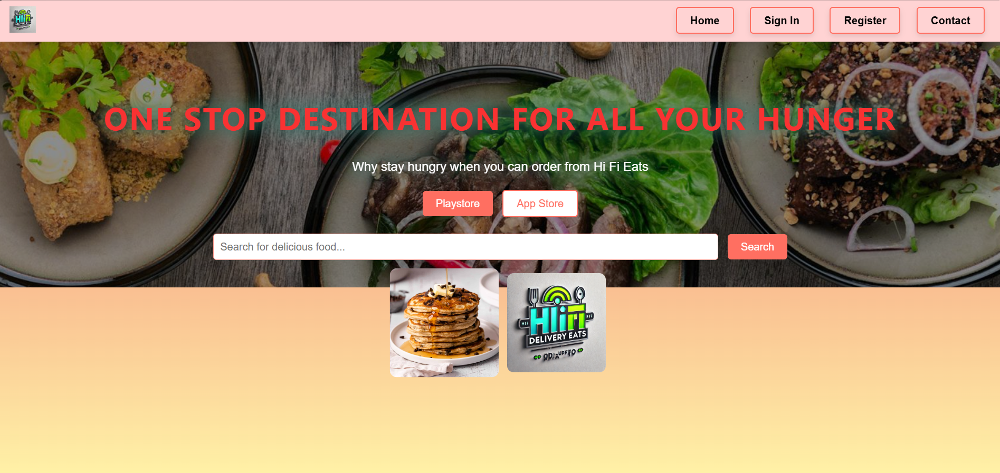
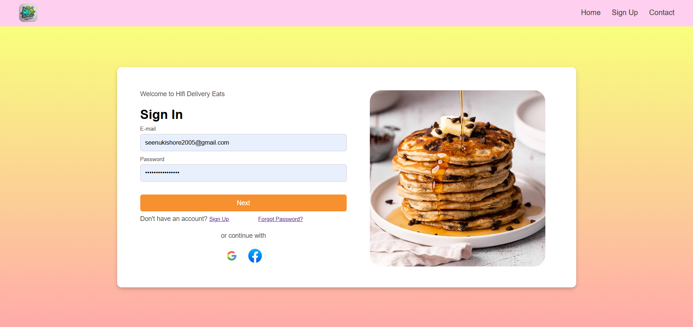
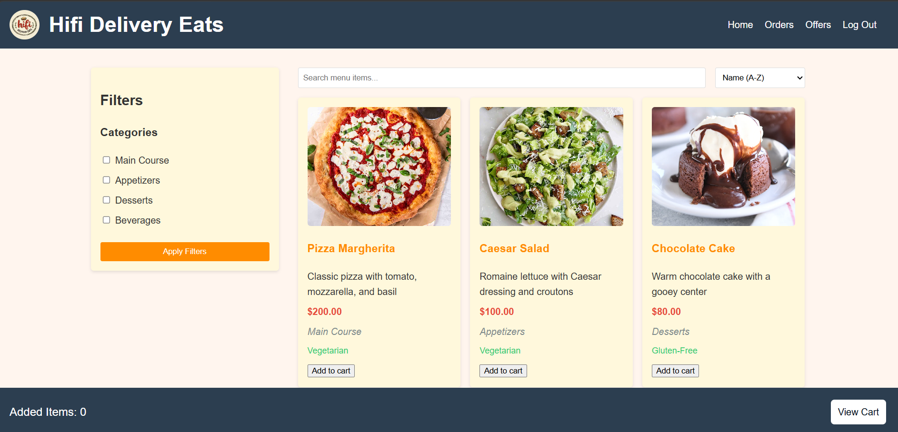
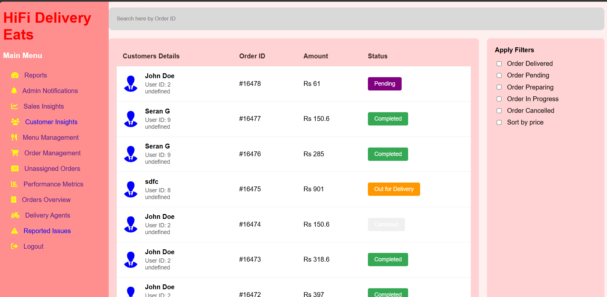
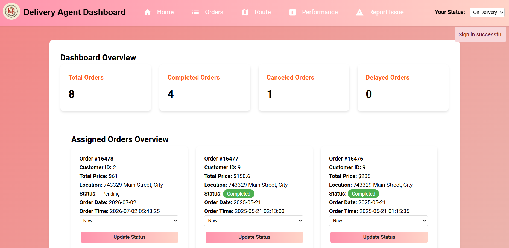

# Hifi_Delivery_Eats

🍔 HiFi Delivery Eats - Online Food Delivery & Management System

📌 Overview

HiFi Delivery Eats is a full-stack food ordering and delivery management platform built to handle the complete order lifecycle — from menu browsing and checkout to live delivery tracking and post-order feedback. The system includes three dedicated experiences: a customer ordering flow, an admin control center for restaurant operations, and a delivery agent dashboard for real-time order fulfillment.

Developed using HTML, CSS, JavaScript for the frontend, and Python (Flask) with SQLite for the backend, HiFi Delivery Eats layers in machine learning-driven analytics — sentiment analysis on customer feedback and anomaly detection on order patterns — to turn raw order data into actionable business insight.

🌐 Live Website

🔗 Live Website: [HiFi Delivery Eats Live](https://hifi-delivery-eats-mmb5.onrender.com)

🎯 Features

✅ Multi-Role Authentication
- User Login/Register: Secure customer access with email/password, plus Google and Facebook OAuth
- Admin Login: Role-gated access to the full restaurant management console
- Delivery Agent Login: Dedicated dashboard for assigned delivery staff

✅ Customer Ordering Experience – Browse menu by category (Main Course, Appetizers, Desserts, Beverages) with dietary filters, add to cart, and complete checkout seamlessly.

✅ Order Tracking & History – Customers can view live order status, cancel orders, and revisit past orders.

✅ Feedback & Sentiment Analysis – Post-delivery feedback is analyzed using TextBlob NLP and visualized as sentiment distribution charts.

✅ Admin Order Management – Searchable, filterable live order table with status control, agent assignment/reassignment, and order reporting.

✅ Delivery Agent Dashboard – Live assigned-order feed, one-click status updates, route view, and issue reporting.

---

🔧 Technologies Used

- Frontend: HTML, CSS, JavaScript
- Backend: Python (Flask)
- Database: SQLite
- Authentication: Authlib (Google & Facebook OAuth)
- Machine Learning: scikit-learn (K-Means clustering), TextBlob (sentiment analysis)
- Data & Reporting: Pandas, Matplotlib, Seaborn, Plotly
- Task Scheduling: APScheduler (background job automation)
- Deployment: Gunicorn, Render

---

🖼️ Screenshots of the Project

📌 Landing Page

Public-facing homepage with search and quick access to sign in and registration.



📌 Sign In Page

Multi-provider authentication supporting email/password, Google, and Facebook login.



📌 Customer Menu Page

Filterable, categorized menu with cart integration and live item counts.



📌 Admin Order Management

Real-time order tracking with searchable order IDs, status filters, and per-customer order history.



📌 Delivery Agent Dashboard

Live assigned-orders view with status updates, delivery metrics, and route access for agents on the ground.



⚙️ Getting Started

Prerequisites
- Python 3.10+
- pip

Installation
```bash
git clone https://github.com/Seran-14/Hifi-Delivery-Eats.git
cd Hifi-Delivery-Eats
pip install -r requirements.txt
```

Environment Setup

Create a `.env` file in the project root:
```env
EMAIL_ADDRESS=your_email@gmail.com
EMAIL_PASSWORD=your_app_password
GOOGLE_CLIENT_ID=your_google_client_id
GOOGLE_CLIENT_SECRET=your_google_client_secret
```

Run the app
```bash
python app.py
```
Visit `http://localhost:5000` in your browser.

---

📌 Project Context

Built as part of the Infosys Springboard 5.0 program, HiFi Delivery Eats was developed as a collaborative team project simulating a real-world, production-grade delivery platform — from database design and multi-provider authentication through to ML-powered business analytics, deployed live on Render.

---

📄 License

This project is licensed under the MIT License — see the [LICENSE](./LICENSE) file for details.

---

🙋 Author

Seran — Final Year B.Tech, AI & Data Science
💻 [GitHub](https://github.com/Seran-14)
